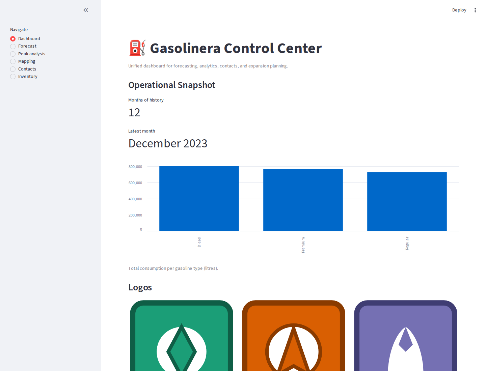
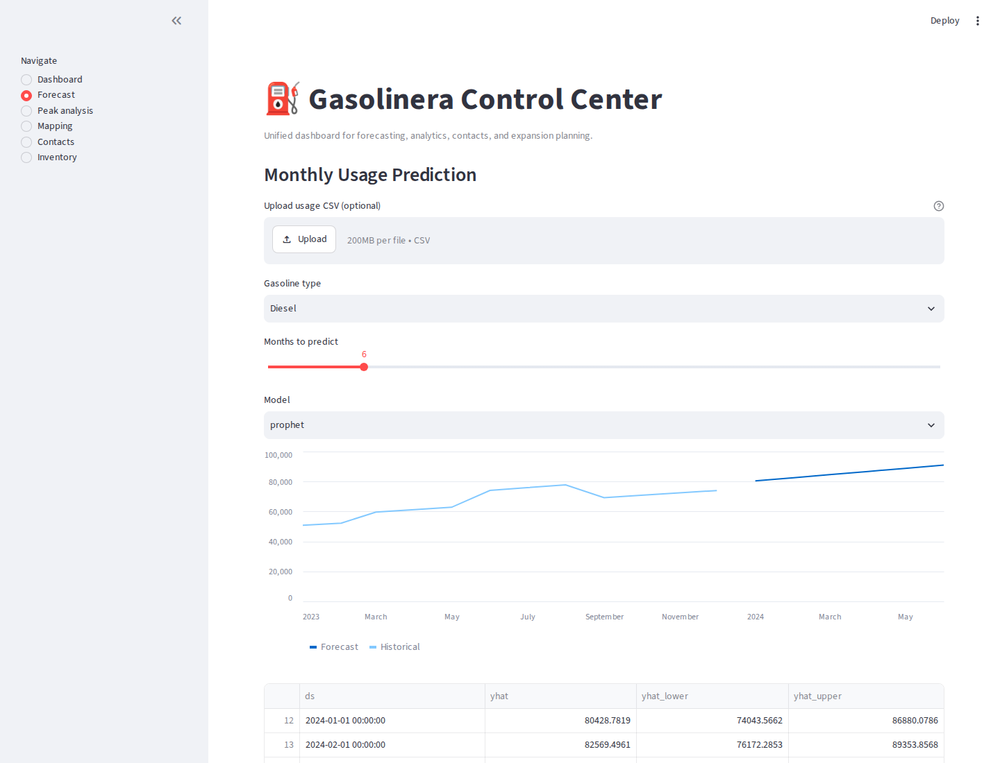
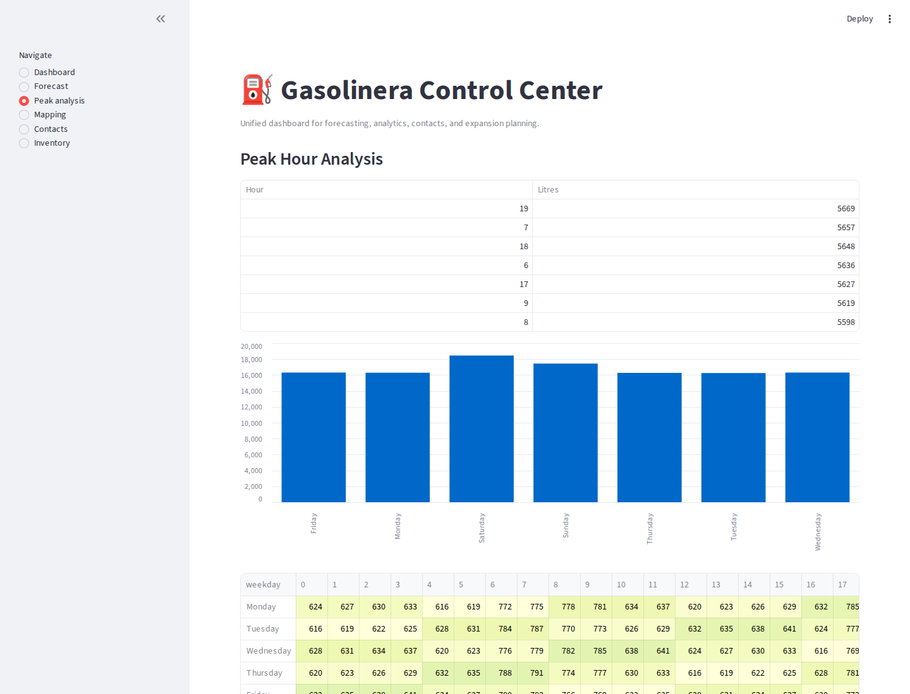
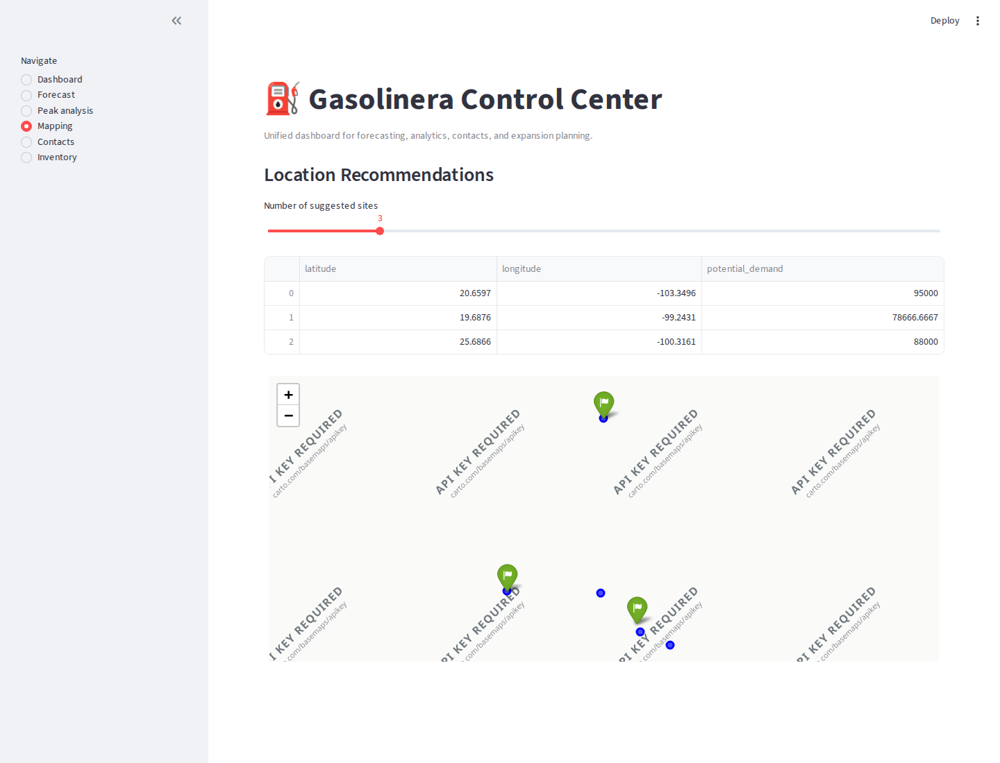
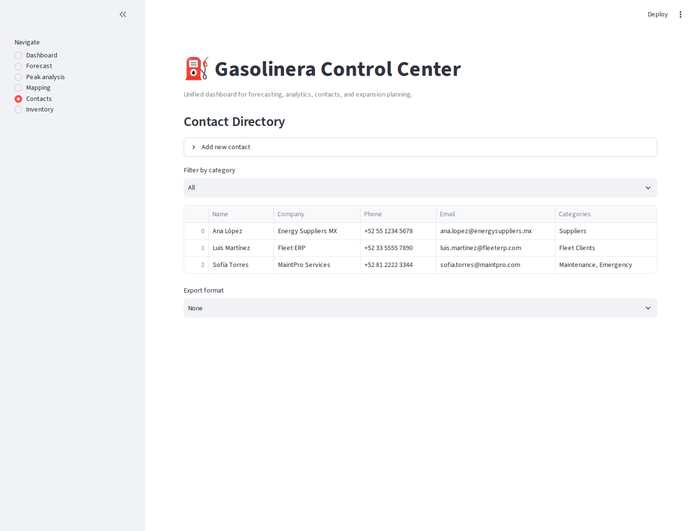
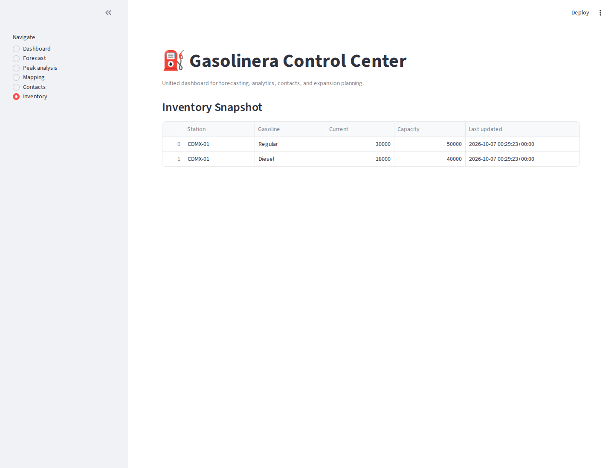

# Fuel Station Operations & Analytics Prototype

Prototype for monitoring fuel inventory, consumption, and restocking.

The project was built around a **Shell fuel-station use case**.

It is a prototype and is not connected to Shell's production systems or live station data.

## What It Does

The backend provides information such as:

- Current inventory
    
- Tank capacity
    
- Weekly liters sold
    
- Average recent consumption
    
- Fuel prices
    
- Last restock date
    
- Estimated days until depletion
    
- Projected depletion date
    
- Suggested restocking date
    
- Inventory warnings
    

The current version works with:

- Regular
    
- Super
    
- Diesel
    

## Running Analytics UI

The repository includes a Streamlit analytics interface for the demo dataset. The screenshots below are generated automatically from the running application, not from design mockups.

<table>
  <tr>
    <td width="50%" align="center">
      <a href="assets/screenshots/gasolinera-dashboard.png"></a><br>
      <strong>Operational Dashboard</strong><br>
      Consumption history and high-level operational snapshot.
    </td>
    <td width="50%" align="center">
      <a href="assets/screenshots/gasolinera-forecast.png"></a><br>
      <strong>Demand Forecasting</strong><br>
      Historical monthly usage with forward predictions.
    </td>
  </tr>
  <tr>
    <td width="50%" align="center">
      <a href="assets/screenshots/gasolinera-peak-analysis.png"></a><br>
      <strong>Peak-Hour Analysis</strong><br>
      Hour and weekday demand patterns from synthetic sales logs.
    </td>
    <td width="50%" align="center">
      <a href="assets/screenshots/gasolinera-mapping.png"></a><br>
      <strong>Location Recommendations</strong><br>
      KMeans-based candidate locations and estimated demand.
    </td>
  </tr>
  <tr>
    <td width="50%" align="center">
      <a href="assets/screenshots/gasolinera-contacts.png"></a><br>
      <strong>Contact Directory</strong><br>
      Categorized operational contacts with export support.
    </td>
    <td width="50%" align="center">
      <a href="assets/screenshots/gasolinera-inventory.png"></a><br>
      <strong>Inventory Snapshot</strong><br>
      Current demo tank levels and capacity by fuel type.
    </td>
  </tr>
</table>

The UI uses synthetic/sample data. Forecasts, clustering outputs, and inventory values are demonstrations of the application workflow and are not connected to real Shell systems.

## Restocking Estimate

The current logic is intentionally simple.

It looks at the last seven days of consumption and calculates an average daily usage.

Estimated days remaining are calculated as:

```text
current inventory / average daily consumption
```

From there, the backend estimates a depletion date and uses the delivery lead time to suggest when another restock should be made.

It also generates:

```text
warning  → estimated depletion within 7 days
critical → estimated depletion within 3 days
```

## Data

The current version uses demo consumption data.

It is not connected to real Shell sales or inventory systems.

The idea was to build the analytics and application structure first so the data source could later be replaced with real operational data.

## Stack

### Backend

- Python
    
- FastAPI
    
- SQLAlchemy
    
- Pandas
    

### Infrastructure

- PostgreSQL / PostGIS
    
- Redis
    
- Docker
    
- Docker Compose
    
- Nginx
    

## Services

The Docker setup includes:

```text
frontend
backend
postgres
redis
nginx
```

The backend exposes:

```text
GET /api/gasoline/stats
```

which provides the fuel statistics used by the dashboard.

## Run Locally

```bash
git clone https://github.com/A625A/GasolineraGestion.git
cd GasolineraGestion
```

Create the local environment files:

```bash
cp env/backend.env.example env/backend.env
cp env/frontend.env.example env/frontend.env
```

Then run:

```bash
docker compose up --build
```

The backend is available at:

```text
http://localhost:8000
```

## Environment Variables

The committed `.env.example` files only contain placeholder values.

For example:

```text
POSTGRES_PASSWORD=CHANGE_ME
REDIS_PASSWORD=CHANGE_ME
MAPBOX_TOKEN=CHANGE_ME
```

Real credentials should stay in local environment files.

## Current Limitations

- Uses demo consumption data
    
- No live station integration
    
- No real Shell production data
    
- Restocking logic is based on recent average consumption
    
- Forecasting has not been validated against real station history
    

## Possible Improvements

Some things I would like to add later:

- Historical consumption stored in PostgreSQL
    
- Real transaction and inventory data
    
- Station-to-station comparisons
    
- Better demand forecasting
    
- Day-of-week and seasonal effects
    
- Anomaly detection
    
- Historical KPI reporting

